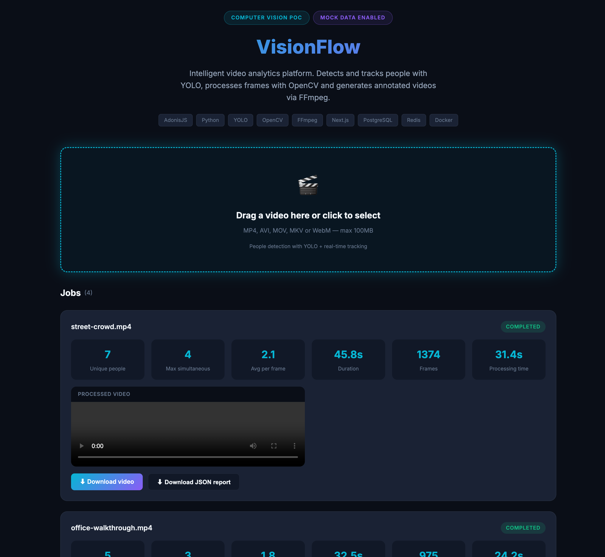
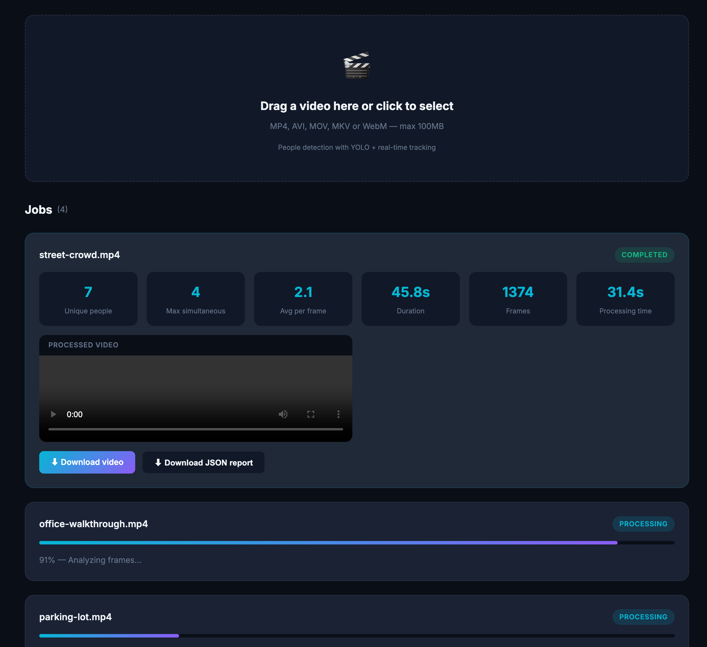

# VisionFlow

**VisionFlow** is an intelligent video analytics platform powered by computer vision. The system accepts a video file, identifies people in each frame, tracks their movement over time, and generates a new video with detections highlighted.

The application lets users upload a video through a web interface, monitor processing progress, and view results directly in the browser. In addition to the processed video, VisionFlow provides metrics such as total people detected, peak simultaneous count, appearance duration, and a detection report.

## Screenshots

### Home — Upload screen


### Dashboard — Full overview



### Jobs — Processing progress



### Completed job — Analytics & player


## What the project does

- Video file upload
- Format and size validation
- Video conversion and normalization
- Frame-by-frame reading and processing
- People detection with artificial intelligence
- Bounding boxes drawn around detected people
- Same-person tracking throughout the video
- Final processed video generation
- Processing progress display
- Statistics presentation
- JSON report generation
- Video and report download

## How it works

```text
User uploads the video
        ↓
AdonisJS receives and validates the file
        ↓
Video enters the processing queue
        ↓
FFmpeg prepares and normalizes the video
        ↓
OpenCV reads the frames
        ↓
YOLO detects people
        ↓
System draws the detections
        ↓
A new video is generated
        ↓
Result appears on the dashboard
```

## Technologies

### AdonisJS and TypeScript

Responsible for the main application API:

- video intake
- file validation
- job management
- status queries
- result delivery
- database and processor communication

### Python

Used by the computer vision processing service, offering excellent support for AI and video manipulation libraries.

### YOLO

AI model used to locate people in each video frame.

For each detection, the model returns:

- person position
- confidence level
- identified class
- bounding box coordinates

### OpenCV

Handles visual frame manipulation:

- video opening
- frame-by-frame reading
- box drawing
- identifier labels
- text and counter overlays
- processed frame generation

### FFmpeg

Used to:

- convert formats
- normalize resolution and FPS
- split or restore audio
- compress the output
- generate the final MP4 file

### Next.js

Powers the web interface:

- video upload
- progress tracking
- original video player
- processed video player
- statistics display
- result downloads

### PostgreSQL

Stores video and processing data:

- file name
- status
- progress
- duration
- resolution
- frame count
- metrics
- file paths
- error messages

### Redis

Used as a queue so videos are processed asynchronously without blocking the API during analysis.

### Docker

Runs all components in a standardized way:

- API
- frontend
- Python processor
- PostgreSQL
- Redis

## Output

After processing, the user receives a video similar to the original, but with identified people:

```text
┌───────────────────────────────────────┐
│                                       │
│     ┌──────────────┐                  │
│     │ Person #1    │                  │
│     │ Confidence 92%│                  │
│     └──────────────┘                  │
│                         ┌───────────┐  │
│                         │ Person #2 │  │
│                         └───────────┘  │
│                                       │
│ People in frame: 2                    │
└───────────────────────────────────────┘
```

A report is also generated:

```json
{
  "status": "completed",
  "durationSeconds": 45.8,
  "processedFrames": 1374,
  "uniquePeople": 7,
  "maximumPeopleInFrame": 4,
  "averagePeoplePerFrame": 2.1,
  "processingTimeSeconds": 31.4
}
```

## Projects

VisionFlow is split into independent modules that communicate through REST API, Redis queue and a shared storage folder.

```text
visionFlow/
├── api/                  # REST API (AdonisJS + TypeScript)
├── web/                  # Web interface (Next.js)
├── processor/            # Vision processor (Python + YOLO)
├── storage/              # Shared file storage
├── docs/                 # Screenshots
├── docker-compose.yml    # Full stack orchestration
├── start.sh              # Quick start script
└── .env.example          # Environment variables template
```

---

### `api/` — REST API (AdonisJS + TypeScript)

Backend responsible for receiving videos, validating files, managing jobs, exposing status and serving results.

**Main responsibilities:**

- Video upload and validation (format, max 100MB)
- Job persistence in PostgreSQL
- Enqueue jobs in Redis (`visionflow:jobs`)
- Progress updates from the processor
- Download of processed video and JSON report

**Key folders:**

| Path | Description |
|------|-------------|
| `app/controllers/` | HTTP endpoints |
| `app/models/` | Lucid models (PostgreSQL) |
| `app/services/` | Upload, queue and storage logic |
| `database/` | SQL init script and migrations |
| `start/` | Routes, middleware and env config |

**Requirements:** Node.js 22+, PostgreSQL 16, Redis 7

**Install and run locally:**

```bash
cd api
npm install
cp ../.env.example ../.env
```

Start PostgreSQL and Redis (Docker example):

```bash
docker compose up postgres redis -d
```

Run database init and start the API:

```bash
PGPASSWORD=visionflow psql -h localhost -U visionflow -d visionflow -f database/init.sql
npm run dev
```

API available at http://localhost:3333

---

### `web/` — Frontend (Next.js)

Web dashboard for uploading videos, tracking job progress and viewing results.

**Main responsibilities:**

- Drag-and-drop video upload
- Real-time progress polling (every 2s)
- Statistics cards (unique people, max simultaneous, frames, etc.)
- Processed video player and downloads
- Mock mode for UI preview without backend

**Key folders:**

| Path | Description |
|------|-------------|
| `app/` | Pages and global layout |
| `components/` | Upload zone and job cards |
| `lib/` | API client and mock data |

**Requirements:** Node.js 22+

**Install and run locally:**

```bash
cd web
npm install
cp .env.example .env.local
npm run dev
```

Open http://localhost:3000

**Mock mode** (no API, Docker or processor needed):

```env
# web/.env.local
NEXT_PUBLIC_MOCK_DATA=true
NEXT_PUBLIC_API_URL=http://localhost:3333
```

---

### `processor/` — Vision Processor (Python)

Background worker that consumes jobs from Redis and runs the computer vision pipeline.

**Main responsibilities:**

- Dequeue jobs from Redis
- Normalize video with FFmpeg (resolution, FPS)
- Detect and track people with YOLOv8
- Annotate frames with OpenCV (boxes, IDs, counters)
- Restore audio and generate final MP4
- Write JSON report and update API progress

**Pipeline:**

```text
FFmpeg → YOLOv8 → OpenCV → FFmpeg (audio) → storage/processed/
```

**Requirements:** Python 3.11+, FFmpeg, Redis, running API

**Install and run locally:**

```bash
cd processor
python3 -m venv .venv
source .venv/bin/activate
pip install -r requirements.txt
```

System dependencies (macOS):

```bash
brew install ffmpeg
```

Run the worker (API and Redis must be running):

```bash
export REDIS_HOST=localhost
export REDIS_PORT=6379
export API_URL=http://localhost:3333
export STORAGE_PATH=../storage
export YOLO_MODEL=yolov8n.pt
python main.py
```

On first run, YOLO downloads the model `yolov8n.pt` (~6MB).

---

### `storage/` — Shared File Storage

Local folder shared between API and processor (mounted as a Docker volume in production).

**Structure:**

| Folder | Content |
|--------|---------|
| `storage/uploads/` | Original uploaded videos |
| `storage/processed/` | Annotated output videos (`.mp4`) |
| `storage/reports/` | JSON reports with metrics |

This folder is gitignored except `.gitkeep` files. Videos and reports are generated at runtime and are not committed to the repository.

---

## Installation & Running

### Prerequisites

| Tool | Version | Used by |
|------|---------|---------|
| Docker + Docker Compose | latest | Full stack |
| Node.js | 22+ | `api/`, `web/` |
| Python | 3.11+ | `processor/` |
| FFmpeg | latest | `processor/` |
| PostgreSQL | 16 | `api/` |
| Redis | 7 | `api/`, `processor/` |

---

### Option 1 — Full stack with Docker (recommended)

Runs all services together: API, web, processor, PostgreSQL and Redis.

```bash
cp .env.example .env
chmod +x start.sh
./start.sh
```

Or manually:

```bash
docker compose up --build
```

| Service | URL |
|---------|-----|
| Web interface | http://localhost:3000 |
| API | http://localhost:3333 |
| Health check | http://localhost:3333/api/health |
| PostgreSQL | localhost:5432 |
| Redis | localhost:6379 |

**Usage flow:**

1. Open http://localhost:3000
2. Upload a video (MP4, AVI, MOV, MKV or WebM — max 100MB)
3. Track progress in real time
4. View statistics, download the annotated video and JSON report

**Useful commands:**

```bash
docker compose logs -f          # follow all logs
docker compose logs -f processor  # processor only
docker compose down             # stop all services
```

> First run downloads Docker images and the YOLO model. Requires ~10–15 GB free disk space.

---

### Option 2 — Run each service locally

Useful for development. Start infrastructure first, then each module in separate terminals.

**Terminal 1 — Infrastructure:**

```bash
docker compose up postgres redis -d
```

**Terminal 2 — API:**

```bash
cd api && npm install && npm run dev
```

**Terminal 3 — Processor:**

```bash
cd processor && source .venv/bin/activate && python main.py
```

**Terminal 4 — Web:**

```bash
cd web && npm install && npm run dev
```

---

### Option 3 — Frontend only (mock mode)

Preview the UI without API, processor or Docker. Requires ~500 MB disk space.

```bash
cd web
npm install
cp .env.example .env.local
```

Set in `web/.env.local`:

```env
NEXT_PUBLIC_MOCK_DATA=true
```

```bash
npm run dev
```

Open http://localhost:3000 — sample jobs with simulated progress, stats and demo video player.

---

## Environment variables

Copy the root template and adjust per environment:

```bash
cp .env.example .env
```

| Variable | Default | Description |
|----------|---------|-------------|
| `PORT` | `3333` | API port |
| `APP_KEY` | — | AdonisJS app key |
| `DB_HOST` | `localhost` | PostgreSQL host |
| `DB_PORT` | `5432` | PostgreSQL port |
| `DB_USER` | `visionflow` | PostgreSQL user |
| `DB_PASSWORD` | `visionflow` | PostgreSQL password |
| `DB_DATABASE` | `visionflow` | PostgreSQL database |
| `REDIS_HOST` | `localhost` | Redis host |
| `REDIS_PORT` | `6379` | Redis port |
| `STORAGE_PATH` | `./storage` | Shared storage path |
| `NEXT_PUBLIC_API_URL` | `http://localhost:3333` | API URL for the web |
| `NEXT_PUBLIC_MOCK_DATA` | `false` | Enable mock mode in web |

Processor-specific variables (set when running locally):

| Variable | Default | Description |
|----------|---------|-------------|
| `API_URL` | `http://localhost:3333` | API base URL |
| `YOLO_MODEL` | `yolov8n.pt` | YOLO model file |
| `CONFIDENCE_THRESHOLD` | `0.5` | Detection confidence |

## API Endpoints

| Method | Route | Description |
|--------|-------|-------------|
| GET | `/api/health` | API status |
| POST | `/api/videos` | Video upload (multipart) |
| GET | `/api/videos` | List all jobs |
| GET | `/api/videos/:id` | Job details and status |
| PATCH | `/api/videos/:id/progress` | Progress update (processor) |
| GET | `/api/videos/:id/download` | Download processed video |
| GET | `/api/videos/:id/report` | JSON report |

## GitHub description

> **VisionFlow is an intelligent video analytics platform built with AdonisJS, Python, YOLO, OpenCV and FFmpeg. It processes uploaded videos, detects and tracks people, generates annotated outputs and provides processing metrics through a modern web interface and REST API.**

## Author

**Elio Lima** — [elio.designer@hotmail.com.br](mailto:elio.designer@hotmail.com.br)

## License

MIT
