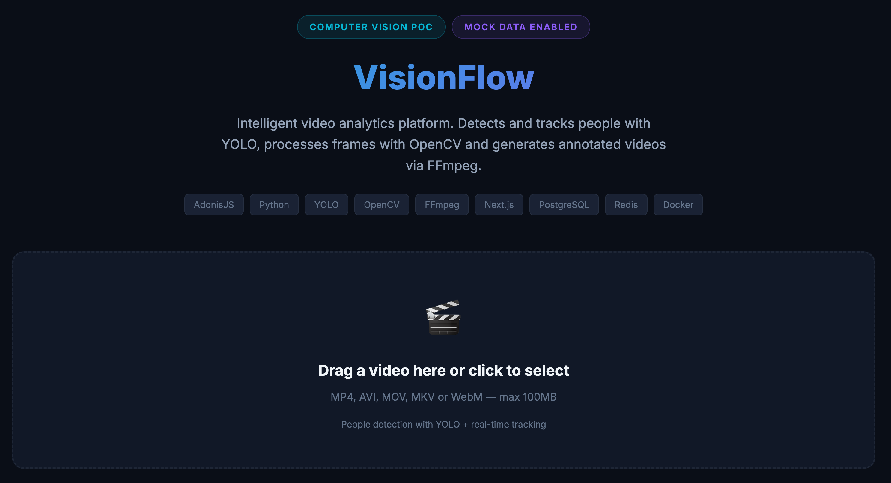
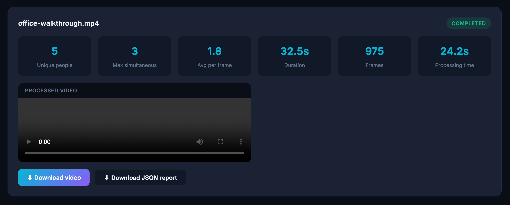
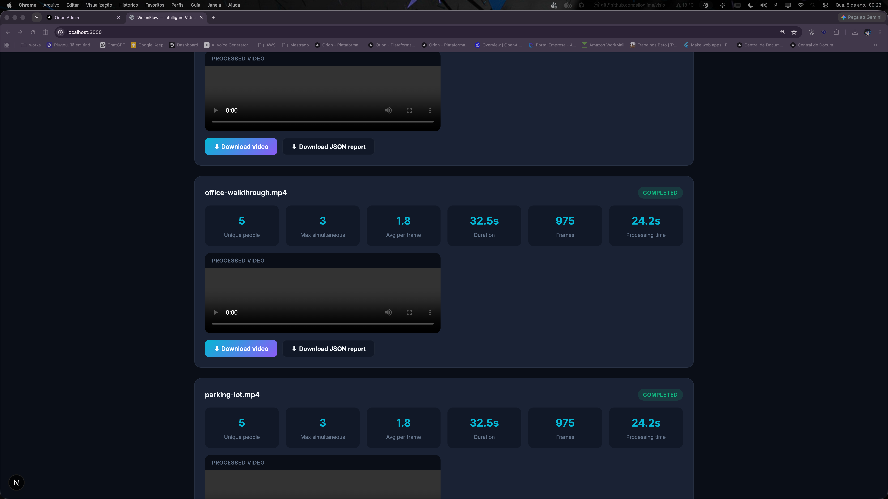
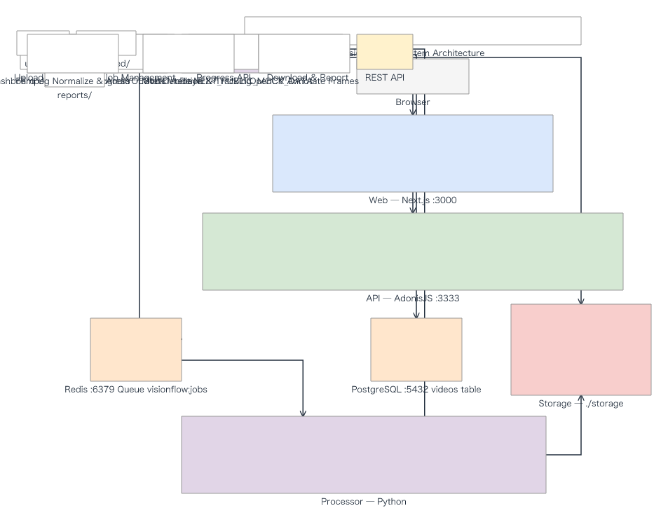
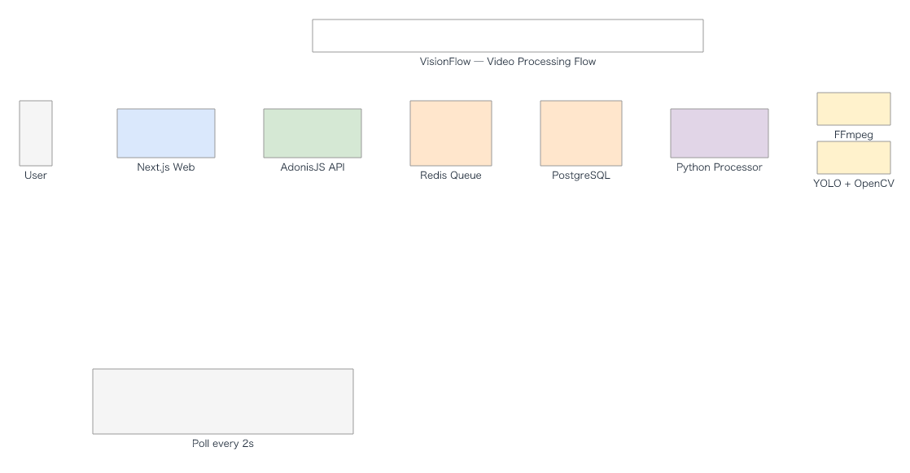
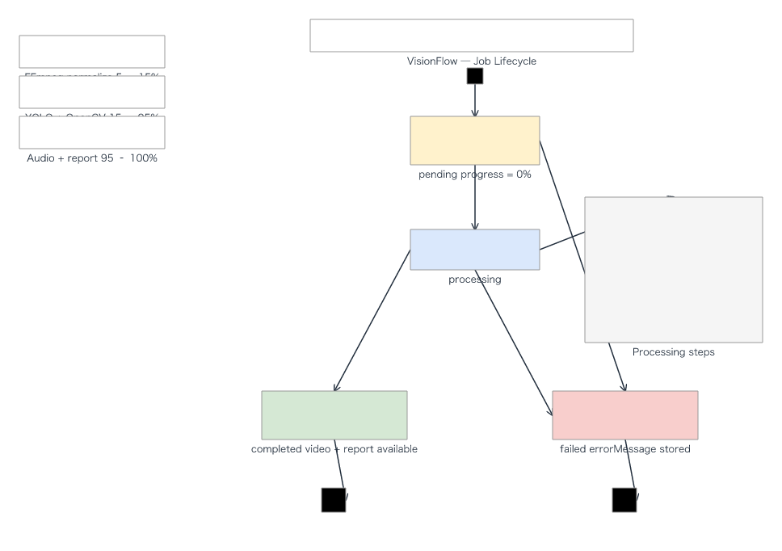

# VisionFlow

**VisionFlow** is an intelligent video analytics platform powered by computer vision. The system accepts a video file, identifies people in each frame, tracks their movement over time, and generates a new video with detections highlighted.

The application lets users upload a video through a web interface, monitor processing progress, and view results directly in the browser. In addition to the processed video, VisionFlow provides metrics such as total people detected, peak simultaneous count, appearance duration, and a detection report.

## Screenshots

### Home — Upload screen



### Completed job — Analytics & player



### Jobs list — Multiple results



## What the project does

- Video file upload
- Format and size validation
- Video conversion and normalization
- Frame-by-frame reading and processing
- People detection with artificial intelligence
- Bounding boxes drawn around detected people
- Same-person tracking throughout the video
- Final processed video generation
- Processing progress display
- Statistics presentation
- JSON report generation
- Video and report download

## How it works

```text
User uploads the video
        ↓
AdonisJS receives and validates the file
        ↓
Video enters the processing queue
        ↓
FFmpeg prepares and normalizes the video
        ↓
OpenCV reads the frames
        ↓
YOLO detects people
        ↓
System draws the detections
        ↓
A new video is generated
        ↓
Result appears on the dashboard
```

## Diagrams

### System Architecture



### Video Processing Flow



### Job Lifecycle



> Editable source files: `diagrams/*.drawio` (open with [draw.io](https://app.diagrams.net))

## Technologies

### AdonisJS and TypeScript

Responsible for the main application API:

- video intake
- file validation
- job management
- status queries
- result delivery
- database and processor communication

### Python

Used by the computer vision processing service, offering excellent support for AI and video manipulation libraries.

### YOLO

AI model used to locate people in each video frame.

For each detection, the model returns:

- person position
- confidence level
- identified class
- bounding box coordinates

### OpenCV

Handles visual frame manipulation:

- video opening
- frame-by-frame reading
- box drawing
- identifier labels
- text and counter overlays
- processed frame generation

### FFmpeg

Used to:

- convert formats
- normalize resolution and FPS
- split or restore audio
- compress the output
- generate the final MP4 file

### Next.js

Powers the web interface:

- video upload
- progress tracking
- original video player
- processed video player
- statistics display
- result downloads

### PostgreSQL

Stores video and processing data:

- file name
- status
- progress
- duration
- resolution
- frame count
- metrics
- file paths
- error messages

### Redis

Used as a queue so videos are processed asynchronously without blocking the API during analysis.

### Docker

Runs all components in a standardized way:

- API
- frontend
- Python processor
- PostgreSQL
- Redis

## Output

After processing, the user receives a video similar to the original, but with identified people:

```text
┌───────────────────────────────────────┐
│                                       │
│     ┌──────────────┐                  │
│     │ Person #1    │                  │
│     │ Confidence 92%│                  │
│     └──────────────┘                  │
│                         ┌───────────┐  │
│                         │ Person #2 │  │
│                         └───────────┘  │
│                                       │
│ People in frame: 2                    │
└───────────────────────────────────────┘
```

A report is also generated:

```json
{
  "status": "completed",
  "durationSeconds": 45.8,
  "processedFrames": 1374,
  "uniquePeople": 7,
  "maximumPeopleInFrame": 4,
  "averagePeoplePerFrame": 2.1,
  "processingTimeSeconds": 31.4
}
```

## Repository structure

```text
visionFlow/
├── api/                  # REST API (AdonisJS + TypeScript)
├── web/                  # Web interface (Next.js)
├── processor/            # Vision processor (Python + YOLO)
├── storage/              # Uploads, processed videos and reports
├── docker-compose.yml    # Service orchestration
├── start.sh              # Quick start script
└── .env.example          # Environment variables
```

## Quick Start

### Prerequisites

- Docker and Docker Compose

### Run

```bash
cp .env.example .env
chmod +x start.sh
./start.sh
```

Or manually:

```bash
docker compose up --build
```

### Access

| Service | URL |
|---------|-----|
| Web interface | http://localhost:3000 |
| API | http://localhost:3333 |
| Health check | http://localhost:3333/api/health |

### Usage flow

1. Open http://localhost:3000
2. Upload a video (MP4, AVI, MOV, MKV or WebM — max 100MB)
3. Track progress in real time
4. View statistics, download the annotated video and JSON report

### Frontend only (mock mode)

If you don't have enough disk space to run Docker, you can preview the UI with mock data:

```bash
cd web
cp .env.example .env.local
```

Set in `web/.env.local`:

```env
NEXT_PUBLIC_MOCK_DATA=true
```

Then run:

```bash
npm install
npm run dev
```

Open http://localhost:3000 to see sample jobs with simulated progress, stats, and a demo video player.

## API Endpoints

| Method | Route | Description |
|--------|-------|-------------|
| GET | `/api/health` | API status |
| POST | `/api/videos` | Video upload (multipart) |
| GET | `/api/videos` | List all jobs |
| GET | `/api/videos/:id` | Job details and status |
| PATCH | `/api/videos/:id/progress` | Progress update (processor) |
| GET | `/api/videos/:id/download` | Download processed video |
| GET | `/api/videos/:id/report` | JSON report |

## GitHub description

> **VisionFlow is an intelligent video analytics platform built with AdonisJS, Python, YOLO, OpenCV and FFmpeg. It processes uploaded videos, detects and tracks people, generates annotated outputs and provides processing metrics through a modern web interface and REST API.**

## License

MIT
